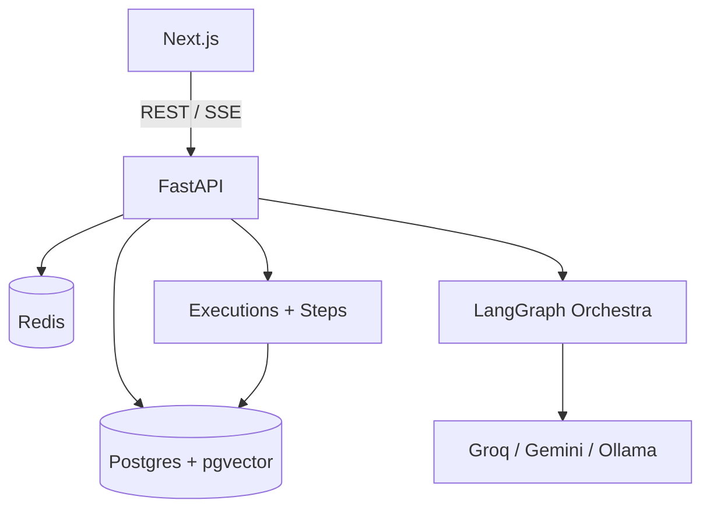

# Orchestra

Production-inspired AI engineering platform for designing, running, evaluating, and debugging LangGraph-powered agents — with memory, RAG (Postgres + **pgvector**), and full execution observability.


---

## Overview

Orchestra is a full-stack workspace for agent development: projects, agents, multi-agent pipelines, knowledge bases, Redis memory, and traced executions with replay. Vectors are stored in **PostgreSQL via pgvector** (not Qdrant).

---

## Features

| Area | Capabilities |
|------|----------------|
| Platform | Auth, projects, agents, Docker, REST + SSE |
| Agents | LangGraph tools graph + Orchestra multi-agent (Planner → Research → Writer → Reviewer) |
| Memory | Redis short-term buffer + Postgres long-term preferences |
| RAG | Upload PDF/DOCX/TXT → chunk → embed (fastembed) → pgvector retrieve |
| Observability | Executions, steps, tokens, cost, latency, ratings, replay, search filters |
| LLM | Groq / Gemini / Ollama via pluggable providers |

---

## Architecture


```text
                Next.js Frontend
                       │
                      REST / SSE
                       │
                FastAPI Backend
                       │
     ┌─────────────────┼─────────────────┐
     │                 │                 │
 PostgreSQL         Redis           LangGraph
 + pgvector      (memory)         Orchestrator
     │                                   │
 embeddings                      Planner → Research
 chunks                          → Writer → Reviewer
                                       │
                                  LLM Providers
```



---

## Tech Stack

| Layer | Stack |
|-------|--------|
| Frontend | Next.js, React, TypeScript, Tailwind CSS |
| Backend | FastAPI, SQLAlchemy, Python 3.12 |
| Data | PostgreSQL + **pgvector**, Redis |
| AI | LangGraph, LangChain-style flows, fastembed |
| Infra | Docker Compose (see also [DEPLOYMENT.md](docs/DEPLOYMENT.md)) |

---

## Folder Structure

```text
Orchestra/
├── backend/          # FastAPI app, agents, RAG, observability
├── frontend/         # Next.js UI
├── database/         # init.sql (extensions + schema)
├── docker/           # docker-compose.yml
├── docs/             # Architecture, API, deployment
└── README.md
```

---

## Screenshots

Capture these locally after `docker compose up` and drop paths under `docs/screenshots/` when ready:

| Screen | Suggested URL |
|--------|----------------|
| Landing | http://localhost:13000/ |
| Login | http://localhost:13000/login |
| Dashboard | http://localhost:13000/dashboard |
| Chat | http://localhost:13000/projects/{id}/chat |
| Knowledge | http://localhost:13000/projects/{id}/knowledge |
| Execution History | http://localhost:13000/projects/{id}/observability |
| Execution detail | http://localhost:13000/projects/{id}/executions/{executionId} |
| API docs | http://localhost:18000/docs |

---

## Quick start (Docker)

```bash
cp .env.example .env
# Add GROQ_API_KEY or GEMINI_API_KEY
cd docker
docker compose --env-file ../.env up --build
```

| Service | URL |
|---------|-----|
| Frontend | http://localhost:13000 |
| API docs | http://localhost:18000/docs |
| Health | http://localhost:18000/health |

Default compose host ports (`FRONTEND_PORT` / `BACKEND_PORT`) avoid clashes with local 3000/8000 — see `.env.example`.

---

## Installation

### Prerequisites

- Docker + Docker Compose, **or**
- Node 20+, Python 3.12, Postgres with pgvector, Redis

### Backend (local)

```bash
cd backend
python -m venv .venv
# Windows: .venv\Scripts\activate
pip install -r requirements.txt
uvicorn app.main:app --reload --port 8000
```

### Frontend (local)

```bash
cd frontend
npm install
npm run dev
```

Set `NEXT_PUBLIC_API_URL` to your API origin.

Cloud deploy: [docs/DEPLOYMENT.md](docs/DEPLOYMENT.md) (Vercel + Railway/Render + Neon + Upstash).

---

## Environment variables

| Variable | Used by | Notes |
|----------|---------|--------|
| `DATABASE_URL` | Backend | `postgresql+psycopg2://…` (pgvector-enabled DB) |
| `REDIS_URL` | Backend | Short-term memory |
| `JWT_SECRET` | Backend | Sign access tokens |
| `CORS_ORIGINS` | Backend | Frontend origin(s) |
| `LLM_PROVIDER` | Backend | `groq` \| `gemini` \| `ollama` |
| `GROQ_API_KEY` | Backend | Free cloud testing |
| `GEMINI_API_KEY` | Backend | Production Gemini |
| `UPLOAD_DIR` | Backend | Knowledge uploads |
| `NEXT_PUBLIC_API_URL` | Frontend | Public API base URL |

Full list: [.env.example](.env.example). **No Qdrant URL** — vectors are in Postgres.

---

## API summary

Base: `/api/v1` · Auth: `Authorization: Bearer <token>` · Interactive: `/docs`

| Area | Endpoints |
|------|-----------|
| Auth | `POST /auth/signup`, `POST /auth/login`, `GET /auth/me` |
| Projects / Agents | CRUD under `/projects`, `/agents` |
| Chat | `POST /chat` (SSE), conversations + messages |
| Knowledge | `/knowledge-bases`, documents, chunks |
| Memory | `/memory/status`, preferences, conversation dump |
| Dashboard | `/dashboard/summary`, `/dashboard/metrics` |
| Executions | `GET /executions?project_id=&limit=&q=&status=&pipeline=` |
| Detail / replay | `GET /executions/{id}`, `POST .../rating`, `POST .../replay` |

**Execution search** supports optional `q` (prompt/response/pipeline/model text), `status`, and `pipeline` in addition to `limit`.

---

## Prompt Library

Agent system prompts and Orchestra role prompts live under `backend/app/prompts/`:

| Module | Role |
|--------|------|
| `system.py` | Shared system framing |
| `planner.py` | Planning / routing |
| `research.py` | Research agent |
| `writer.py` | Drafting |
| `reviewer.py` | Quality review |
| `fast_answer.py` | Simple Q&A path |

Edit these modules to tune multi-agent behavior without changing graph wiring.

---

## Observability

Each chat turn creates an **Execution** with timed **ExecutionSteps**, token/cost aggregates, heuristic scores, and an optional snapshot for **replay**.

- UI: Project → **Observability** (Execution History) — search, filter, open detail
- Metrics: today’s count, success rate, latency, tokens, cost, step averages
- Replay: restore prompt + pipeline flags into Chat

See [docs/ARCHITECTURE.md](docs/ARCHITECTURE.md) for the Day 10 system diagram.

---

## Roadmap

- [ ] Human-in-the-loop interrupts
- [ ] Stronger evaluation (LLM-as-judge optional)
- [ ] MCP tool packs
- [ ] Workflow templates / marketplace
- [ ] Guardrails and model routing policies

---

## License

MIT — see repository license file if present; otherwise treat as MIT for personal/portfolio use.
