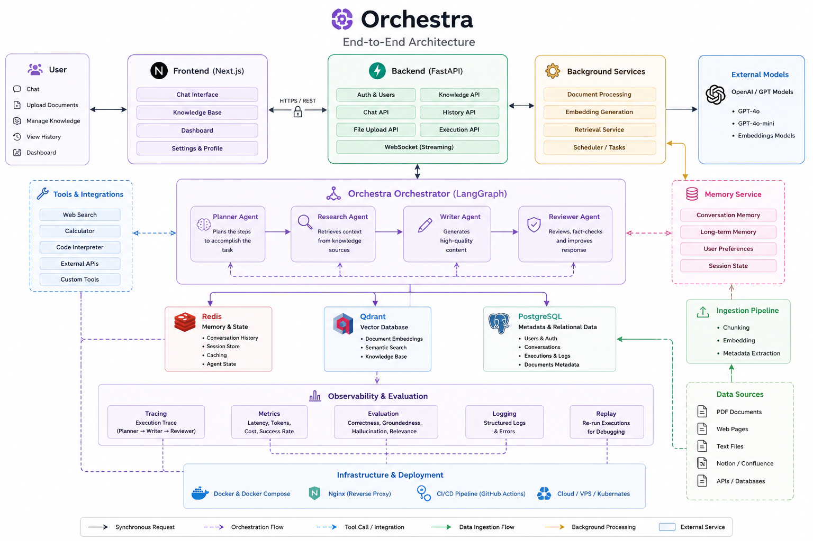
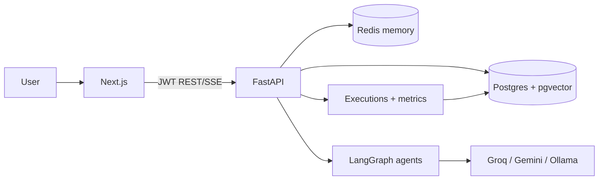

# Architecture — Day 10 (system overview)

End-to-end production shape of Orchestra after Days 1–10. **Vectors use Postgres + pgvector** (not Qdrant).



```text
                         ┌──────────────────────┐
                         │   Next.js Frontend   │
                         │  Landing · Chat · KB │
                         │  Observability · Replay│
                         └──────────┬───────────┘
                                    │ REST + SSE
                         ┌──────────▼───────────┐
                         │    FastAPI Backend   │
                         │  Auth · Projects ·   │
                         │  Chat · RAG · Memory │
                         │  Trace · Evaluate    │
                         └──────────┬───────────┘
              ┌─────────────────────┼─────────────────────┐
              │                     │                     │
     ┌────────▼────────┐   ┌────────▼────────┐   ┌───────▼────────┐
     │ Postgres+pgvector│   │     Redis      │   │   LangGraph    │
     │ users, agents,   │   │ short-term     │   │ Orchestra /    │
     │ chunks+embeddings│   │ conversation   │   │ tools graph    │
     │ executions/steps │   │ buffer         │   └───────┬────────┘
     └─────────────────┘   └─────────────────┘           │
                                                    LLM providers
                                                 Groq / Gemini / Ollama
```



**Day 10 UI/docs polish:** branded landing, 404, execution search (`q` / `status` / `pipeline`), deployment guide. Earlier day notes follow.

---

# Architecture — Days 1–6

## Principle

Days 1–2 built the platform (auth, projects, agents).  
Day 3 introduced LLM chat + SSE streaming.  
Day 4 adds tool calling via a registry.  
Day 5 adds LangGraph orchestration (planner → tool → reviewer → answer).  
**Day 6 adds knowledge ingestion:** upload documents, extract text, chunk, embed, store in pgvector. No RAG query yet.

## Day 6 architecture

```text
User
  │
  Upload PDF / DOCX / TXT
  │
FastAPI (knowledge router)
  │
  ├─ save file (uploads volume)
  ├─ extract text (PyMuPDF / python-docx)
  ├─ boundary-aware chunk text (~400 tokens, ~80 overlap)
  ├─ embed chunks (fastembed — BAAI/bge-small-en-v1.5, 384-d)
  └─ store vectors + metadata
         │
         ├─ PostgreSQL + pgvector (embeddings)
         └─ PostgreSQL (document + chunk metadata)
```

## Knowledge module layout

| File | Responsibility |
|------|----------------|
| `knowledge/upload.py` | Validate upload, save file, extract text |
| `knowledge/chunker.py` | Split text into overlapping chunks |
| `knowledge/embedding.py` | Generate dense vectors (fastembed) |
| `knowledge/vector_store.py` | Persist chunks + embeddings |
| `knowledge/service.py` | Ownership checks + ingestion pipeline |
| `knowledge/router.py` | REST endpoints |

## Layers (Day 6)

| Layer | Pieces |
|-------|--------|
| API | `knowledge/router.py` |
| Service | `knowledge/service.py` — background processing |
| Repository | `repositories/knowledge_repository.py` |
| Models | `KnowledgeBase`, `Document`, `DocumentChunk` |
| Infra | pgvector extension, `pgvector/pgvector:pg16` Postgres image |

## What Day 6 does **not** include

- Similarity search / RAG retrieval (Day 7)
- Chat integration with knowledge bases
- Replacing the mock `search` tool with real vector search

## Day 4 architecture (unchanged)

```text
                User
                  │
           Next.js Chat
                  │
            POST /chat
                  │
               FastAPI
                  │
         LLM Chat Completions
                  │
        ┌─────────┴─────────┐
        │                   │
   Normal Response      Tool Call
                            │
                    Tool Registry
                            │
       ┌────────┬────────┬────────┐
       ▼        ▼        ▼
 Calculator  Weather   Search
   (AST)    (Open-Meteo) (mock KB)
       │
       ▼
 Tool Result → LLM (tools off) → Final Answer (SSE)
```

## Layers

| Layer | Day 4–5 pieces |
|-------|----------------|
| API | `api/v1/chat.py` — `/chat`, `/tools`, conversations |
| Service | `chat_service.py` LangGraph flow; LLM providers |
| Graph | `graph/state.py`, `nodes.py`, `workflow.py` |
| Tools | `tools/base.py`, `registry.py`, calculator/weather/search |
| Repository | conversations/messages; knowledge (Day 6) |
| Models | `Conversation` / `Message`; knowledge tables (Day 6) |

## Tool-calling data flow

1. User sends a message (`enable_tools=true` by default)  
2. FastAPI verifies JWT + project ownership  
3. Persist user message  
4. Build LLM payload: system (+ tool guidance) + history + `tools[]` schemas  
5. LangGraph runs planner → tool → reviewer → answer  
6. For each tool call → SSE `tool_start` / `tool_result` + `graph_step`  
7. Stream final answer tokens  
8. Persist assistant message; SSE `done`

## Built-in tools

| Tool | Implementation |
|------|----------------|
| `calculator` | Safe AST arithmetic (no `eval`) |
| `weather` | Live **Open-Meteo** (geocode city → lat/lon → current weather); mock fallback if offline |
| `search` | Mock Orchestra knowledge snippets (stand-in until RAG Day 7) |

## SSE events

```text
meta | user_message | tool_start | tool_result | graph_step | token | done | error
```

## What stays the same

- Auth / projects / agents CRUD  
- Conversation + message persistence (user + assistant only)  
- No tool-trace DB tables yet  
- Redis still unused for memory (Day 8)
